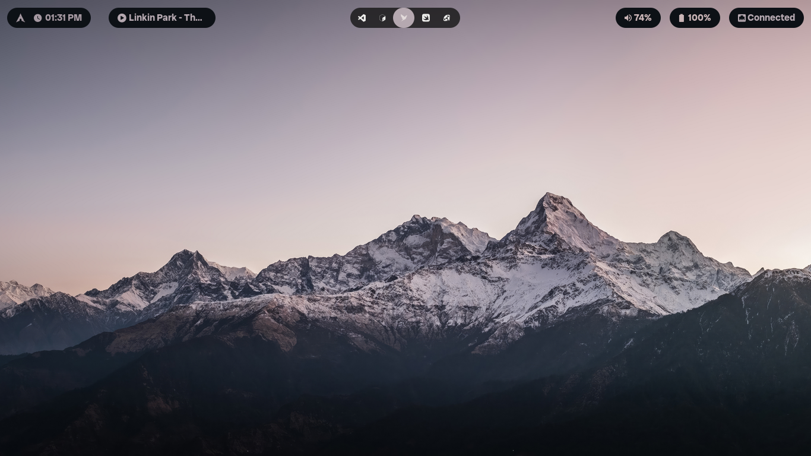
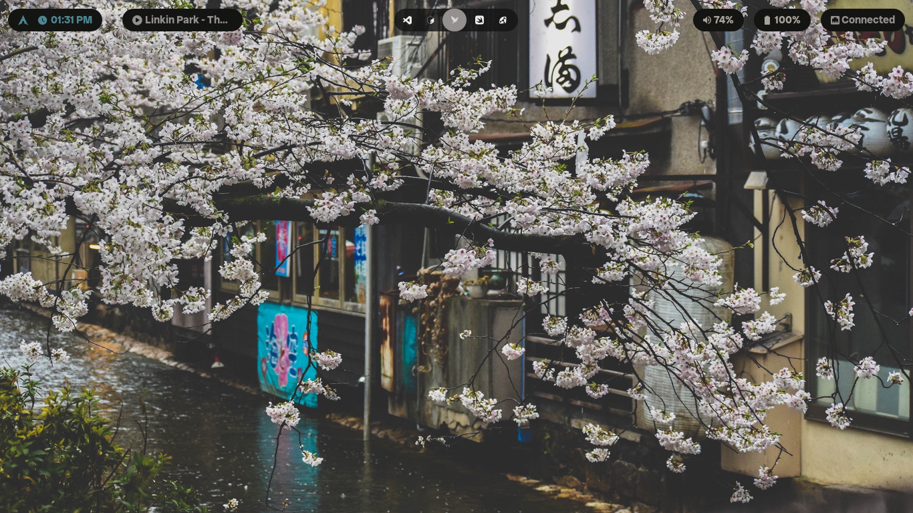
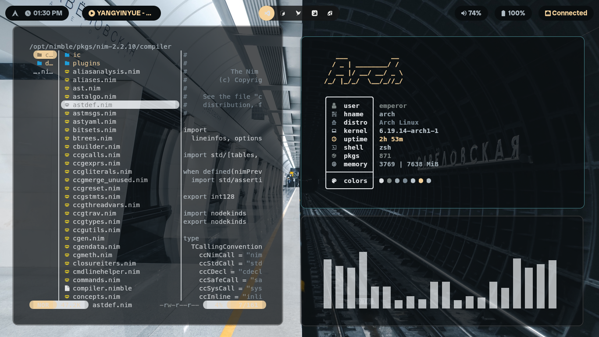
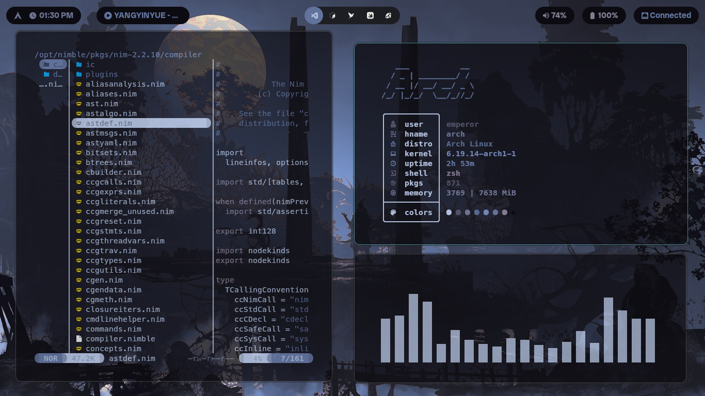
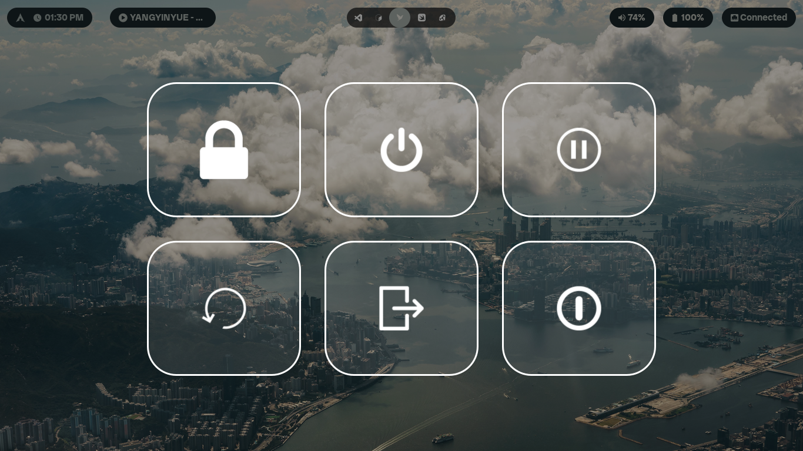

<p align="center">
  
</p>

<p align="center">
  <em>A clean, modular Arch Linux dotfiles configuration</em>
</p>

<p align="center">
  
  
  
  
</p>

<p align="center">
  <a href="#about">About</a> •
  <a href="#features">Features</a> •
  <a href="#-screenshots">Screenshots</a> •
  <a href="#-whats-included">What's Included</a> •
  <a href="#requirements">Requirements</a> •
  <a href="#installation">Installation</a> •
  <a href="#configuration">Configuration</a> 
</p>

---

## About

A comprehensive, modular dotfiles configuration for **Arch Linux** designed to provide a cohesive and productive desktop environment using **Hyprland** on **Wayland**. This setup prioritizes clarity, modularity, and ease of customization.

---

## Features

- 🪟 **Hyprland** (Wayland compositor)
- 🎨 **Material You** colors via `pywal`
- 🖥️ **Kitty** terminal emulator with custom themes
- 📝 **Neovim** with LSP support and custom plugins
- 🎵 **Cava** audio visualizer with custom shaders and themes
- ⚙️ **Waybar** status bar with weather integration
- 📋 **Wofi** application launcher with custom styling
- 🔒 **Hyprlock** screen locking
- 🎨 **Fontconfig** with optimized font rendering
- 🧩 **Modular structure** for easy customization
- ⚡ **Performance-focused** configuration
- 🧠 **Beginner-friendly** with clear organization

---

##  Screenshots

<!-- Hero shot (large) -->
<p align="center">
  
</p>

<!-- Gallery -->
<p align="center">
  
  
</p>

<p align="center">
  
  
</p>

<p align="center">
  
  
</p>

<p align="center">
  <em>Clean • Modular • Material You inspired</em>
</p>

---

## 📦 What's Included

### Core Components

| Directory | Purpose |
|-----------|---------|
| `hypr/` | Hyprland configuration and keybindings |
| `nvim/` | Neovim editor setup with plugins and LSP |
| `kitty/` | Terminal emulator theme and settings |
| `waybar/` | Status bar with modules and scripts |
| `wofi/` | Application launcher configuration |
| `cava/` | Audio visualizer with shaders and themes |

### Additional Configuration

| Directory | Purpose |
|-----------|---------|
| `fontconfig/` | Font rendering and configuration |
| `hyprlock.conf` | Screen lock settings |
| `hyprpaper.conf` | Wallpaper management |
| `Thunar/` | File manager settings |
| `wlogout/` | Session/logout menu |

---

## Requirements

- **Arch Linux** (base install)
- `git`
- `yay` (or another AUR helper)
- Basic Linux knowledge

---
## Appearance

- GTK Theme: [Graphite GTK Theme](https://github.com/vinceliuice/graphite-gtk-theme)
- Fonts: [JetBrainsMono Nerd Font](https://github.com/ryanoasis/nerd-fonts/releases/download/v3.0.2/JetBrainsMono.zip)


---


## Installation

### 1. Clone the repository

```bash
git clone https://github.com/Empeeror18/Arch-dotfiles.git
cd Arch-dotfiles
```

### 2. Backup existing configuration

```bash
# Backup your current dotfiles if they exist
mkdir -p ~/.dotfiles-backup
cp -r ~/.config/* ~/.dotfiles-backup/ 2>/dev/null || true
```

### 3. Install the dotfiles

```bash
# Copy all configurations to your home directory
cp -r * ~/

# Or manually copy specific components:
cp -r hypr/ ~/.config/
cp -r nvim/ ~/.config/
cp -r kitty/ ~/.config/
cp -r waybar/ ~/.config/
cp -r wofi/ ~/.config/
cp -r cava/ ~/.config/
```

### 4. Install dependencies

```bash
# Essential packages
yay -S hyprland waybar wofi kitty cava hyprlock hyprpaper

# Neovim and tools
yay -S neovim ripgrep fd stylua

# Additional tools
yay -S python-pywal imagemagick playerctl

# Fonts (optional but recommended)
yay -S ttf-google-sans-flex noto-fonts noto-fonts-emoji
```

### 5. Set your shell and reload

```bash
# Ensure your shell is set correctly
exec bash
# or
exec zsh
```

---

## Configuration

### Hyprland Keybindings

Check [hypr/binds.conf](hypr/binds.conf) for all available keybindings.

**Common keybinds:**
- `Super + Return` - Open terminal (Kitty)
- `Super + D` - Open application launcher (Wofi)
- `Super + Q` - Close window
- `Super + F` - Toggle fullscreen
- `Super + V` - Toggle split/layout

### Customization

#### Changing Colors
Colors are managed through `pywal`. Update the color scheme:

```bash
wal -i /path/to/wallpaper.jpg
```

#### Waybar Modules
Edit [waybar/config.json](waybar/config.json) to customize modules and layout.

#### Neovim Plugins
Plugins are managed via `lazy.nvim`. Check [nvim/lua/plugins/init.lua](nvim/lua/plugins/init.lua) to add or remove plugins.

#### Kitty Theme
Update colors in [kitty/colors.conf](kitty/colors.conf).

---

## Directory Structure

```
Arch-dotfiles/
├── cava/                    # Audio visualizer config
├── fontconfig/              # Font configuration
├── hypr/                    # Hyprland config
│   ├── binds.conf
│   ├── hyprland.conf
│   ├── hyprlock.conf
│   ├── hyprpaper.conf
│   └── scripts/
├── kitty/                   # Terminal emulator
├── nvim/                    # Neovim configuration
│   └── lua/
│       ├── configs/
│       ├── plugins/
│       ├── chadrc.lua
│       ├── mappings.lua
│       └── options.lua
├── waybar/                  # Status bar
│   ├── config.json
│   ├── style.css
│   └── scripts/
├── wofi/                    # Application launcher
├── wlogout/                 # Logout menu
├── Thunar/                  # File manager
└── wallpapers/              # Wallpaper collection
```

---

## Troubleshooting

### Hyprland won't start
- Ensure you have a Wayland-compatible GPU driver installed
- Check `~/.cache/hyprland/` for error logs

### Missing fonts
- Install `ttf-google-sans-flex` and other font packages
- Rebuild font cache: `fc-cache -fv`

### Waybar not showing
- Check waybar config: `waybar -c ~/.config/waybar/config.json`
- View logs for errors

### Neovim LSP not working
- Run `:LspInfo` in Neovim to check server status
- Ensure language servers are installed (e.g., `yay -S lua-language-server`)


---

## 📌 Notes
These dotfiles are personal — may not work perfectly out of the box.  
Some configs may require manual tweaks


## ⭐ Acknowledgements

Inspired by various Arch dotfiles from the community ❤️


---
<p align="center">
  <em>Author: Samrat Aryal</em>
</p>


<p align="center">
  <a href="https://github.com/Empeeror18/Arch-dotfiles">
    GitHub Repository
  </a>
</p>
